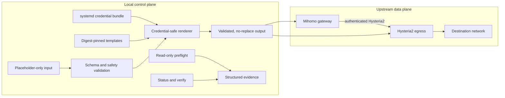
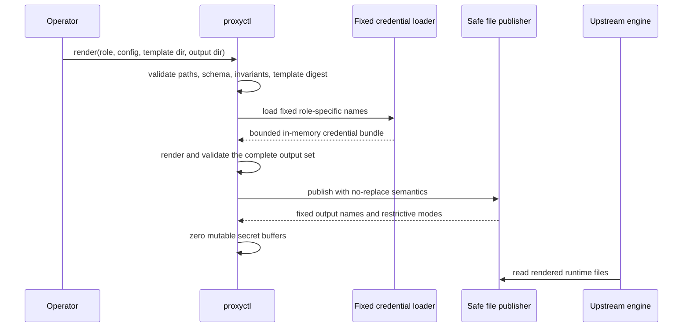
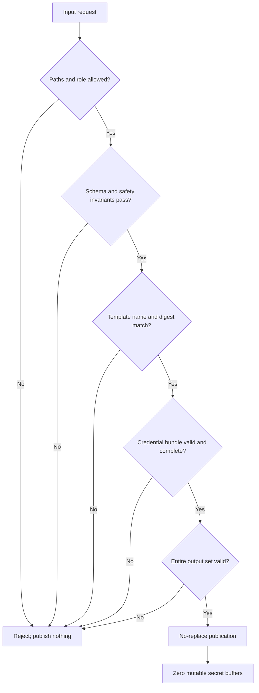

# proxyctl

`proxyctl` is a local, security-focused control-plane CLI for validating and
rendering a two-role proxy configuration. It prepares native configuration for
a Mihomo gateway and a Hysteria2 egress while keeping credentials out of Git.
It does not implement or forward proxy traffic itself.

## Architecture

The tool separates a local control plane from the upstream data plane:



`proxyctl` owns validation, rendering, local evidence checks, and release
metadata. Mihomo and Hysteria2 remain independent upstream processes. Service
activation, firewall changes, DNS, certificates, remote execution, and secret
provisioning stay outside the CLI trust boundary.

### Configuration and credential flow



The renderer never accepts a caller-selected credential path or credential
name. A role-specific allowlist controls which values and certificate assets
may be loaded and which fixed files may be published.

### Fail-closed model



Important invariants include:

- strict allowlists for schema fields, roles, credentials, templates, and
  output names;
- rejection of direct fallback, insecure TLS, unsafe public listeners,
  traversal, symlinks, unknown fields, and embedded real credentials;
- validation of the entire publication set before the first write;
- fixed-name, no-replace output with restrictive permissions;
- secret-safe structured errors and explicit buffer cleanup;
- deterministic release bundles with checksums, SBOM, provenance, and pinned
  upstream artifacts.

If a multi-file publication fails after one file is created, already-published
files are retained for explicit inspection. The tool never performs a
delete-by-name rollback that could be redirected to a file it does not own.

## Commands

```text
proxyctl preflight --role gateway|egress [--offline] [--config PATH]
proxyctl render --role gateway|egress --template-dir DIR --config PATH --out-dir DIR
proxyctl verify --profile loopback|canary
proxyctl status [--json] [--state-dir DIR]
proxyctl version
```

- `preflight` performs read-only local checks and reports structured evidence.
- `render` validates placeholder-only input and produces engine-native runtime
  files from a fixed credential bundle.
- `verify` evaluates a named local invariant profile without opening sockets or
  invoking external commands.
- `status` reads local state and emits either human-readable or JSON output.

See the [CLI reference](docs/proxyctl-cli.md),
[credential-rendering decision](docs/adr-prx01-render-runtime-credentials.md),
[release format](docs/prx02-release.md), and optional generic ingress references
for [Hysteria2](docs/hysteria-gateway.md) and
[IKEv2](docs/ikev2-gateway.md).

## Build and test

```sh
go build ./cmd/proxyctl
go test ./...
go vet ./...
python3 -m unittest discover -s tests -p 'test_*.py'
python3 tools/secret_scan.py --self-test
python3 tools/secret_scan.py
```

## Scope

`proxyctl` is not a proxy engine, secret store, installer, deployment system,
remote executor, DNS client, certificate manager, or firewall manager. It does
not open network listeners, run `systemctl`, or connect to remote hosts.

## License

MIT. See [LICENSE](LICENSE).
